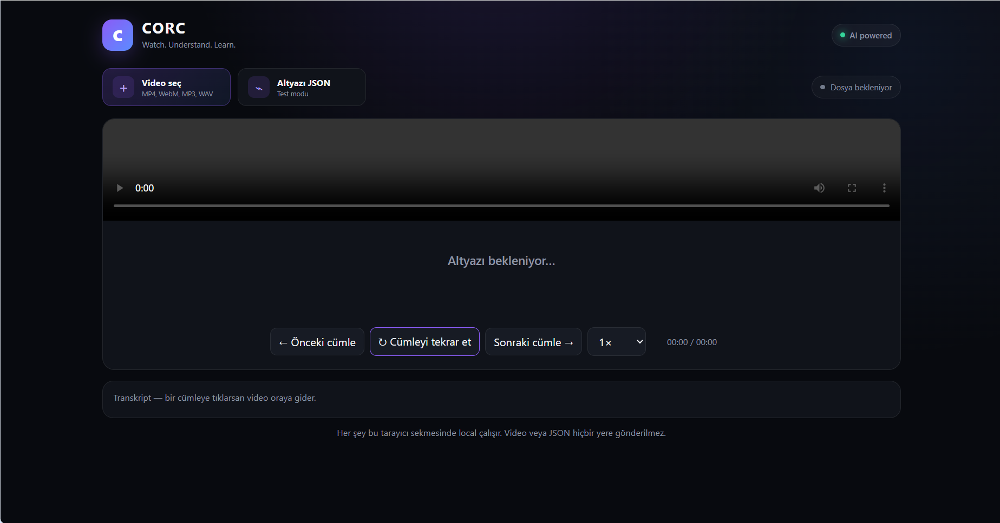
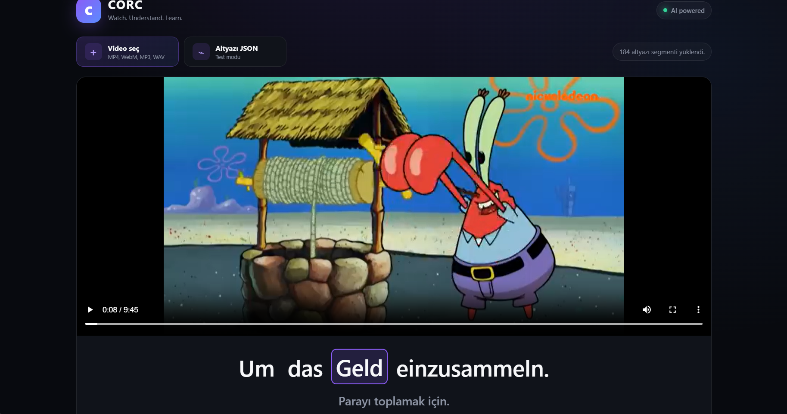

# CORC

**Watch. Understand. Learn.**

CORC is an AI-powered video player for language learners. It transcribes a foreign-language video with word-level timestamps, translates every sentence into Turkish with context, and plays the result in an interactive player where the current word is highlighted as it is spoken.

<p align="center">
  
  
</p>

---

## Features (v0.1)

- 🎬 **Video player** with 0.5× – 1.5× playback speed
- 🔤 **Word-level highlighting:** the current word lights up in sync with the audio
- 🇹🇷 **Sentence-by-sentence Turkish translation** below the transcript
- ⏮️ **Sentence navigation:** jump to the previous or next sentence, or repeat the current one
- 📜 **Clickable transcript:** click any sentence to jump to that point in the video
- 🧠 **Context-aware translation:** each batch is translated together with the surrounding sentences, so meaning carries across sentence boundaries
- ✅ **Translation QA pass:** a second LLM pass reviews and corrects the translations, and a final check fills in any empty ones

## How it works

```
Video / audio file
      │
      ▼
Whisper large-v3 ───────────► segments + word-level timestamps
      │
      ▼
Context-aware translation ──► batches of 20 sentences, ±3 sentences of context
      │
      ▼
Translation QA ─────────────► review pass + empty-translation check
      │
      ▼
subtitle_words_tr.json ─────► interactive CORC player (templates/index.html)
```

The pipeline runs on the [Groq API](https://console.groq.com/): `whisper-large-v3` handles transcription and `openai/gpt-oss-120b` handles translation and QA, both at temperature 0 for reproducible output. Words are assigned to sentences by their timestamp midpoint.

### Output format (example)

```json
[
  {
    "start": 8.12,
    "end": 10.54,
    "text": "Um das Geld einzusammeln.",
    "translation": "Parayı toplamak için.",
    "words": [
      { "word": "Um", "start": 8.12, "end": 8.3 },
      { "word": "das", "start": 8.3, "end": 8.52 }
    ]
  }
]
```

---

## Getting started

**1. Install dependencies**

```bash
git clone https://github.com/ezgiieyice/corc.git
cd corc
pip install -r requirements.txt
```

**2. Add your Groq API key** to a `.env` file in the project folder:

```
GROQ_API_KEY=your_key_here
```

**3. Generate the transcript and translation.** Put your video in the project folder as `test.mp4`, then run:

```bash
python app.py
```

This creates `subtitle_words_tr.json`.

**4. Open the player.** Open `templates/index.html` in your browser, then select the video and the generated JSON file.

---

## Project structure

```
├── app.py                 # transcription → translation → QA → JSON pipeline
├── templates/
│   └── index.html         # interactive player (HTML/CSS/JS, runs in the browser)
├── assets/                # screenshots
└── requirements.txt
```

## Tech stack

Python · Groq API (Whisper large-v3, GPT-OSS-120B) · HTML / CSS / JavaScript

---

> CORC is under active development.
